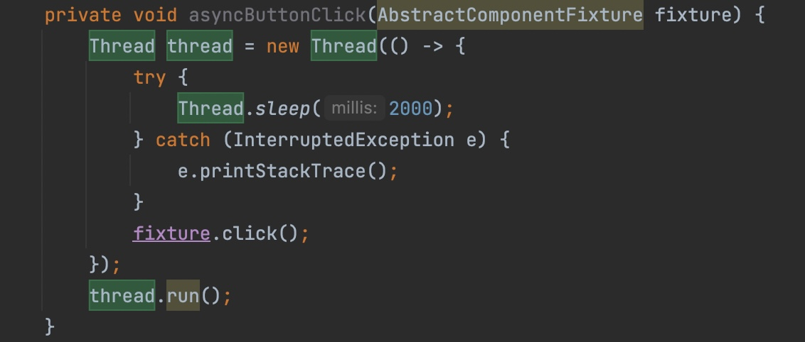

# Minesweeper Debugging
## Andres, Alex, Jonathan

Tools: jAssert, JUnit, PIT, JaCoco 

### GameIntegrationTest

To run this test file, the tester will need to click "Play again" on every dialog box that appears to resume the script running

Certain interactions in Game were not feasible to test using state-based testing and would require a framework like Moquito to facilitate interaction-based testing.

No faults were found using Integration Testing

### GameTest Instructions
When running any Game class test that results in a pop-up dialogue box, select any option that is NOT "Exit." 
Normally, we simply select "Play again," if an option box comes up with only "Yes" or "No," "Yes" was selected. "Reset" and "Close" should also be okay to select.
Commented instructions that describe deleting data rows in the local database can be ignored as the BeforeEach method now
rewrites the database before each method.

### Branch Coverage and Loop Boundary Adequacy
*Loop Boundary Adequacy* often could not be reached because either the loops were set to run at least twice because the loops are set up to search nearby cells in the board. In other instances, it was not possible to attain because the parameters that the loop cycle through were not accessible. And in most other instances, it is because it loops through a game board to access cells, and hardcoded values in the code do not allow for a board to be smaller than 2x2 cells.

For *Branch Coverage*, the following will explain the branches that jacoco reports as uncovered:

All exceptions in Jacoco either have been triggered by the unit tests, or are not possible to trigger during runtime (for example, in Game initialization there is a URISyntaxException that checks that the hardcoded string value written in the code actually corresponds with an existing file).

In the *Score Class*, line 101 and 111 are if statements. They cannot be failed because the only time a longest streak is different from a current streak is if it has been loaded from a database, which we are minimally interacting with.

*Cell*, *Board*, and *UI* are already covered (Save for exceptions however they have also been triggered despite the report).

*Game Class*:
In ResumeGame(), ShowScore(), WindowClosing(), and ActionPerformed(), we were unable to reach the branches that had 
event listeners due to the asynchronous behavior of the code. We attemped to reach these branches using GUI function calls
however it was hard to hook into the correct frame since the were not apart of the GUI testing suite. 

In GameWon(), GameLost(), ShowScore(), WindowClosing(), and ActionPerformed(), we are unable to reach these branches mainly because they contain event handler events which cannot
be reached synchronously within the unit test. We attempted this by creating a helper function that woudl executre the
GUI actions on another thread: 
However this solution was unreliable since at times the code would not execute in time on both threads and this would mean
we would have time insert thread sleeps which would overcomplicate the tests. So we were unable to reach any branches with
event listeners because of the need for asynchronous code execution.

In GameWon(), if statement on 246 cannot be entered because if the individual has won, they have by default set a best time, so the best times array will not be empty.

In MouseClicked(), the if statement on 831 is always true, because if the "playing" field is false entering this method, it is made true just before this if statement.

### Board UnitTesting
Failing Tests:
For all failures, they are made on assumptions of functionality since there is no documentation in this source code.

- public void testBoardMoreMinesThanCellsMinesInitCorrect() : 
  There is no check for whether the number of mines exceeds the number of cells on the board.
  Thus initialization leads to an infinite loop.

- public void testCreateEmptyCellsNotSquareBoard() : 
  Creating a board that is not made of a perfect square grid of cells. It specifically throws an index out of bounds error and this is because every for loop in the code, including the loop that creates the board, the 2D array is index backwards. Specifically, the columns are indexed with the row variable and vice-versa.

- public void testCreateEmptyCellsNoInitializationColumns() AND
  public void testCreateEmptyCellsNoInitializationRows() : 
  A Board is created despite initializing it with no columns or no rows.

- public void testCalculateNeighboursIndicesFarOutOfBounds() : 
  False failure.

- public void testLoadSavedGameDefaultBoardNoPriorSave() : 
  There is no check for if a previously saved board exists before trying to load it, so an SQL exception is thrown.

- public void testLoadSavedGameIntoNewBoardDiffDims() : 
  The method seems to suggest that a saved board can be loaded into whatever board object the load method is called on. However, if the dimensions differ, an index out of bounds error will trigger.

### Cell UnitTesting
Failing Tests:
For all failures, they are made on assumptions of functionality since there is no documentation in this source code.

- public void testSetAndGetContentIllegalCharacter() : 
  There is no check for unused characters when "setting the content" of a cell. The documentation states that used characters are: M, F, "", and the numbers 0-8. There is no check that the content you are setting are any of these characters, so no illegal argument exceptions are thrown and it does not prevent illegal setting of content.

### Score UnitTesting
Failing Tests:
For all failures, they are made on assumptions of functionality since there is no documentation in this source code.

- public void testDecCurrentStreakNotNegative() : 
  This method is supposed to decrement the current streak value, however, given the general defintion of a "streak", a negative streak does not make sense. However, this method does not prevent the currentStreak field from entering the negatives.

- public void testGetLongestLosingStreakWhenStreakIsLostAndThenRecreated() AND
  public void testGetLongestWinningStreakWhenStreakIsLostAndThenRecreated() : 
  Again, definition of a streak being the number of consecutive times an event occurs. The losing streak is not interrupted by incrementing a winning streak, as would be expected. So if you have lost once, then won a game, then lost twice, your longest losing streak is 2, but the method continues to increment the field so it claims the longest losing streak is 3.

The same error occurs for winning streaks interrupted by a losing streak.

- public void testPopulateSQLException() : 
  False failure. This method, like some others, will fail when run in bulk, but will pass when run individually.

### Game UnitTesting
Failing Tests:
For all failures, they are made on assumptions of functionality since there is no documentation in this source code.

- public void setTestImagesNoBoardMissingRows() : 
  This is another case of not checking if there is a board to edit before indexing. This, I believe, is a result of hardcoded values instead of trying to access parameters of the board such as size().

- public void testGameLostFirstGame() : 
  When you lose your first game, this method calls "decrement current streak" method, but there is no check for having a negative streak which does not make logical sense.

- public void testMouseClickedLeftClickOnUnflaggedMine() : 
  False failure. This method, like some others, will fail when run in bulk, but will pass when run individually. I believe this is caused by the local database but it is unclear since the BeforeEach should rewrite the database before every test

- public void testShowScoreMultipleBestTimes() : 
  False failure. This method, like some others, will fail when run in bulk, but will pass when run individually. I believe this is caused by the local database but it is unclear since the BeforeEach should rewrite the database before every test

### UI UnitTesting
Failing tests:

- public void testConstructorNegativeByNegative() : 
Note that there is not documentation supporting this to be the correct behavior, this is an assumption based on review of the code. Fault detected: Expect an illegal argument exception to be thrown for an illegal argument, not a NegativeArraySizeException

- public void testNumButtonsZeroByNonZero() : 
no documentation about expected behavior so this is an assumption. Fault detected: Expect an IllegalArgumentException to be thrown for an illegal argument, not an ArrayIndexOutOfBoundsException

- public void testNumButtonsNonZeroByZero() : 
Fault detected: No exception thrown for an illegal argument

- public void testConstructorNegativeMines() : 
Fault detected: No exception thrown for an illegal argument

- public void testConstructorMoreMinesThanTiles() : 
Fault detected: we would expect an illegal argument exception to be thrown for an illegal argument, not a NegativeArraySizeException

### GUI Testing
Failing tests: 

- public void numberOfMinesShouldNotGoBelowZero() :
This failure is due to a fault in the code which never checks if the numnber of mines can go below zero, which means the
user can right-click on as many cells as they want (and make the number of mines negative).

- public void statisticsShouldBeEmptyForNewGame() :
This failure is due to the database being written in the tests. However this test may past if the file is empty but from
experience it will fail every other test run. 

### PIT Mutation Analysis
We reported a low mutation score simply because the there is high coupling in a lot of the source code and often times a
mutation in the code would not result in a change of gameplay. First of all we were unable to include Board.java in the
PIT analysis since any mutation to that file resulted in SQL exceptions which would cause PIT to fail. When we ran it on
other files little to no mutations would be killed mainly because a lot of the unit testing check for faults in the
functions altering these functions may not change how the unit test would perform simply becase there is high coupling
in these functions amd these functions would do more than one thing. Because more than one thing would be done in these
methods it made it hard to perform mutation analysis. Also for some GUI test these would create weak mutations since the
output may not change if the UI was differnt (i.e. a different color or number of cells)

This is why we were unable to complete mutation testing with PIT. 

